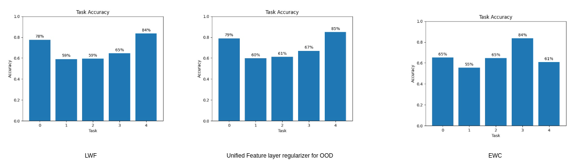

# Task Agnostic Class Incremental Learning using Feature Embedding Regularization


**Pytorch**  implementation of continual OOD detection based on [1] A Simple Unified Framework for Detecting Out-of-Distribution Samples and Adversarial Attacks along with a feature regularization idea.


Following results show that our approach can learn incrementally without pretraining on all tasks like in [1] and without catastrophically forgetting when compared to lwf and ewc using a Resnet-18 and Cifar-10.




## Requirements

```
bash prepare_data_packages.sh
```

## Datasets

This repo trains one SVHN, CIFAR-10 and CIFAR-100. With OOD datasets used lsun_resize and imagenet_resize.

## Parameters (main.py)
### Train Params
- --batch_size: batch size for data loader
- --epochs: training epochs
- --patience: training patience
- --dataset: cifar10 | cifar100 | svhn
- --dataroot: path to dataset
- --outf: folder to output results
- --num_classes: the # of classes
- --net_type: resnet | densenet
### Flags
- --debug: debug mode to reduce model size and number of tasks
- --lwf: Baseline LWF flag
- --ewc: Baseline EWC
- --reproduce: Reproducing Deep Mahalanobis compute
- --continual: Class incremental scenario with deep Mahalanobis  
- --mahalanobis: flag to add mahalanobis computation
### Continual params
- --ood_regularizer: Feature regularizer lambda
- --nb_tasks: number of class incremental tasks
- --risk: Compute uncertainty of each new task to switch lwf on/off
### wandb config
- --wandb: use wandb for logging the experiment
- --wandb_api: Wandb API key
- --wandb_entity: Entity posting wandb logs if any
- --wandb_project: Project name of wandb logs if any
- --wandb_run_name: Wandb Run Name

## References
[1]P. Kimin Lee, “A Simple Unified Framework for Detecting Out-of-Distribution Samples and Adversarial Attacks,” in Neural Information Processing Systems, 2018, pp. 184–191, Accessed: Jan. 27, 2021. [Online]. Available: https://proceedings.neurips.cc/paper/1987/file/c81e728d9d4c2f636f067f89cc14862c-Paper.pdf.


